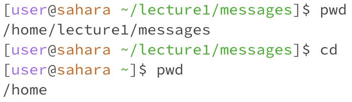
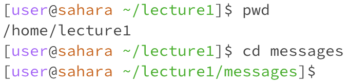
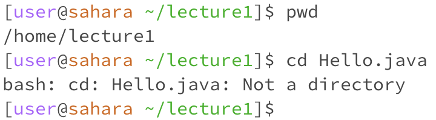
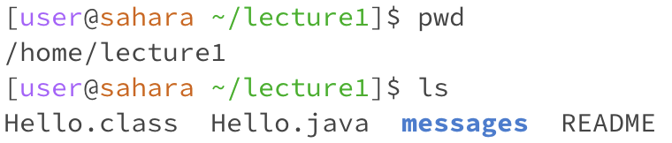
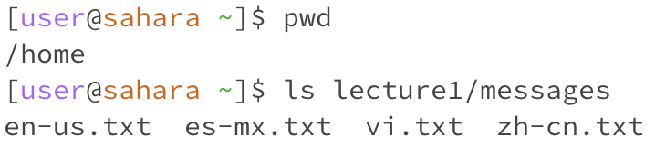
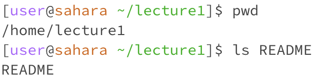
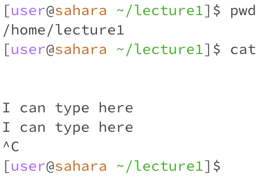
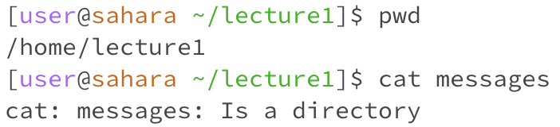
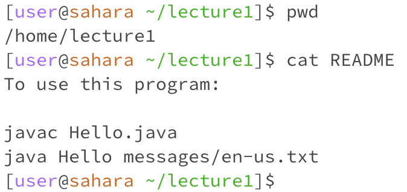

# Lab 1
## cd
1. **no arguments:** 

The working directory initially was `/home/lecture1/messages`, and it changed to `/home` after running `cd`. There was no argument, but I could see this change after I printed the working directory again. It seems like this happened because when I passed in no arguments, it converted that to directory expressed as the `~`, which was home.

This was not an error.

2. **directory argument:** 

The working directory initially was `/home/lecture1`, and it changed to `/home/lecture1/messages` after running `cd messages`. There was no output, but in the next line, the prompt changed to show the change of working directory that came from combining the relative path of `messages` to my initial working directory.

This was not an error.

3. **file argument:** 

The working directory initially was `/home/lecture1` again, and it did not change after running `cd Hello.java`. The output told me that this was not a directory, which makes sense because I can't change directory into something that's not a directory like the file `Hello.java`.

This was an error because I gave the `ls` command a file when it expected a directory.

## ls
1. **no arguments:** 

The working directory was initially `/home/lecture1`. After running `ls`, the terminal output all of the files and folders in the `lecture1` folder because I provided no relative path, meaning that the terminal just used my working directory `lecture1`.

This was not an error.

2. **directory argument:** 

The working directory was initially `/home`. I ran the command `ls lecture1/messages`, and it printed the names of all of the files in the `messages` folder. This happened because the terminal combined the current working directory with the `lecture1/messages` relative path I gave it and printed the names of everything in that resultant absolute path.

This was not an error.

3. **file argument:** 

The working directory initially was `/home/lecture1`. After running `ls README`, it just printed the name of the file I gave it, `README`. I think this happened because when the terminal got the absolute path `/home/lecture/README`, it realized that it represented a file, not a folder, so it just listed out the file name.

This was not an error.

## cat
1. **no arguments:** 

Initially, the working directory was `/home/lecture1`. After running `cat` with no argument, it turned the terminal into a mode where I could type in some input, and whenever I hit the return key, it would output that same input until I hit exit. I suppose that this happened because like the `cd` command, `cat` has a special case where it is given no arguments.

This was not an error.

2. **directory argument:** 

The initial working directory was `home/lecture1`. After I ran `cat messages`, it printed some text telling me that `messages` is a directory. I got this output because it was expecting the path I gave it to lead to a file to read out, not a folder.

This was an error because I gave the `cat` command a directory instead of a file.

3. **file argument:** 

The working directory initially was `home/lecture1`. Running `cat README` resulted in an output showing me the contents of the `README` file because the `cat` command took the file at the path it got from my working directory and input and prints out what's inside.

This was not an error.