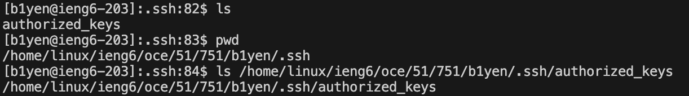

# Lab 2
## part 1
### ChatServer.java code

### Screenshot 1:

`handleRequest()` is called with the URI `/add-message?s=pen pineapple apple pen&user=Brian Yen` as the argument. When this method is first called, `str` is still an empty string. The query from the URI is parsed into the string `"Brian Yen: pen pineapple apple pen\n"`, which is then added to `str`. By the time it's returned, `str` equals `"Brian Yen: pen pineapple apple pen\n"`.

### Screenshot 2:

`handleRequest()` is called again, this time with the URI `/add-message?s=one two three four five!&user=joe` as the argument. This time, when this method is called, `str` equals `"Brian Yen: pen pineapple apple pen\n"`. The query in the URI is parsed into the string `"joe: one two three four five!\n`, which is also added onto `str`. When the method returns `str`, it equals `"Brian Yen: pen pineapple apple pen\njoe: one two three four five!\n"`.

## part 2

### private key path

### public key path

### login without password

## part 3

I learned how to login to a remote server using the `ssh` command. Another thing I didn't know how to do before was configuring ssh keys to log into a remote server without needing to type in my password every time.

I also learned basic ways to handle URIs as well as starting a simple server, both of which I wasn't familiar with before when using Java.