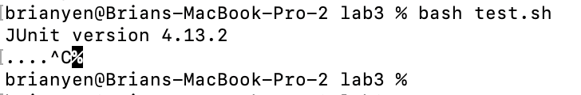
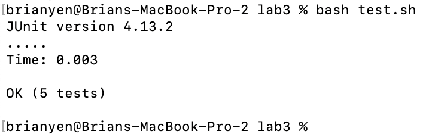

# Lab 3
## part 1
### Failure Inducing Input (for Linked List)

```java
@Test
public void testManyAppend() {
    LinkedList input1 = new LinkedList();

    input1.append(10);
    input1.append(24);
    input1.append(23);

    assertEquals(10, input1.root.value);
    assertEquals(24, input1.root.next.value);
    assertEquals(23, input1.root.next.next.value);
}
```

### Non-Failure Inducing Input

```java
@Test
public void testOneAppend() {
    LinkedList input1 = new LinkedList();
    input1.append(5);
    assertEquals(5, input1.root.value);
}
```

### Symptoms With Failure

There is an infinite loop, and I must Ctrl+C to exit.



Note: Commenting out the `testManyAppend()` test results with this output:



### Bug

Before:

```java
public void append(int value) {
    if(this.root == null) {
        this.root = new Node(value, null);
        return;
    }
    // If it's just one element, add if after that one
    Node n = this.root;
    if(n.next == null) {
        n.next = new Node(value, null);
        return;
    }
    // Otherwise, loop until the end and add at the end with a null
    while(n.next != null) {
        n = n.next;
        n.next = new Node(value, null);
    }
}
```

After:

```java
public void append(int value) {
    if(this.root == null) {
        this.root = new Node(value, null);
        return;
    }
    // If it's just one element, add if after that one
    Node n = this.root;
    if(n.next == null) {
        n.next = new Node(value, null);
        return;
    }
    // Otherwise, loop until the end and add at the end with a null
    while(n.next != null) {
        n = n.next;
    }
    n.next = new Node(value, null);
    return;
}
```

In the old code, the loops would run until `n` reaches the end of the list. However, the line `n.next = new Node(value, null);` would add a new node after `n` at the end of every iteration, meaning that `n` would never be the end of the list.

To fix this, I moved the line that added a new node to outside of the while loop, so that `n` would reach the end of the list first, and then only add a new node once.

## part 2

### grep -A [num] (found with `man`)

Example 1:
```
brianyen@Brians-MacBook-Pro-2 docsearch % grep -r -A 2 "base pair" technical/plos/
technical/plos//journal.pbio.0020223.txt:        Watson-Crick base pairing, the proximity of the synthetic reactive groups elevates their
technical/plos//journal.pbio.0020223.txt-        effective molarity by several orders of magnitude, inducing a chemical reaction. Because
technical/plos//journal.pbio.0020223.txt-        reactions do not take place between reactants linked to mismatched (noncomplementary) DNA,
--
technical/plos//journal.pbio.0020190.txt:        sequence, which is a specific series of eight base pairs in the DNA of the bacterial
technical/plos//journal.pbio.0020190.txt-        chromosome that stimulate the action of proteins that bring about recombination (Eggleston
technical/plos//journal.pbio.0020190.txt-        and West 1997). Similarly, the immunoglobulin genes of mammals have recombination signal
--
technical/plos//journal.pbio.0020190.txt:        chromosomes, on the order of one or two thousand base pairs of DNA (or less—their length is
technical/plos//journal.pbio.0020190.txt-        difficult to measure), in which recombination events tend to be concentrated. Often they
technical/plos//journal.pbio.0020190.txt-        are flanked by “coldspots,” regions of lower than average frequency of recombination
```

Example 2:

```
brianyen@Brians-MacBook-Pro-2 docsearch % grep -A 4 -r "Gerald" technical/plos/
technical/plos//journal.pbio.0020267.txt:        center director Geraldine Dawson explained that this tackling of specific deficits will
technical/plos//journal.pbio.0020267.txt-        help researchers attach them to particular “mind modules” in the brain and will ultimately
technical/plos//journal.pbio.0020267.txt-        lead to the genes that control the development or function of those modules. That modular
technical/plos//journal.pbio.0020267.txt-        view, however, is not shared by many of her colleagues elsewhere, who argue that autistic
technical/plos//journal.pbio.0020267.txt-        behaviors are the result of a system-wide perturbation of early brain development and
``````

With this option, you can also display `num` lines after each instance where the given string is found. This could be useful if you need to know more about how and why a snippet of code is used without having to open the file separately.

### grep -e [pattern] (found with `man`)

Example 1 (note: output cut off for brevity): 
```
brianyen@Brians-MacBook-Pro-2 docsearch % grep -r -e "-functional" technical/biomed
technical/biomed/gb-2003-4-4-r24.txt:          relative risk that is associated with the non-functional
technical/biomed/gb-2002-3-9-research0043.txt:          pseudogenes (which are usually non-functional from their
technical/biomed/gb-2001-2-7-research0025.txt:          positional-functional coupling may be due to regulated
technical/biomed/1471-2091-2-13.txt:        becomes non-functional and is lost, resulting in an intron
technical/biomed/1471-2121-3-16.txt:          appeared to be completely non-functional, pointing to the
technical/biomed/1471-2202-3-20.txt:        expressing a non-functional PER2 protein both exhibit
technical/biomed/gb-2003-4-7-r43.txt:          mutations accumulate more rapidly in non-functional DNA
technical/biomed/1471-2121-3-15.txt:        multi-functional regulators of early embryogenesis and
technical/biomed/1471-2172-3-1.txt:        express the TCR, which are non-functional and potentially
technical/biomed/gb-2002-3-8-research0040.txt:          non-functional protein sequences. As with functional

```

Example 2:
```
brianyen@Brians-MacBook-Pro-2 docsearch % grep -e " 52 " -e " 171 " -r technical/plos
technical/plos/pmed.0010058.txt:        366 million in 2030, up from 171 million in 2000 [1].
technical/plos/pmed.0010064.txt:          reported nonadherence following regimen reinitiation yet reached 52 copies/ml before
technical/plos/pmed.0020033.txt:        in 52 patients with MS, followed up for at least two years after initiation of IFNβ

```

With this option, you can specify a pattern to match. In example one, the pattern I used started with a hyphen, which would have caused an error with the command if the pattern had been specified without the `-e` option. In example two, I was able to specify multiple patterns to match at once.

### grep --exclude [pattern] (found with `man`)

Example 1:
```
brianyen@Brians-MacBook-Pro-2 docsearch % grep -r --exclude "*pmed*" "123" technical/plos
technical/plos/journal.pbio.0020148.txt:        Development (Dec 1; 1996; 123: 1–461) on the first two mutagenesis
technical/plos/journal.pbio.0020148.txt:        http://dev.biologists.org/content/vol123/issue1/index.shtml
```

Example 2
```
brianyen@Brians-MacBook-Pro-2 docsearch % grep -r --exclude "*journal*" "123" technical/plos
technical/plos/pmed.0010028.txt:          Evaluation Program of the NCI under an Investigational New Drug application BB 6123 held
technical/plos/pmed.0010051.txt:        hematological parameters were as follows: Hb,123 g/l; MCV, 106 fl; platelets, 296 × 10
```

This option allows you to exclude files with names that matches the pattern you provide. This could be useful if you know there is a certain files or type of file that has mentions of your searched-for pattern, but you want to ignore those files.


### grep -n (found with `man`)

Example 1:
```
brianyen@Brians-MacBook-Pro-2 docsearch % grep -r -n "airplane" technical/plos
technical/plos/pmed.0010052.txt:58:        airplanes. Our view of our “nature” is closely linked to the technologies that we have
technical/plos/journal.pbio.0020216.txt:103:        airplane crashes into water, for example Birgenair Flight 301 and AeroPeru Flight 603 in
```

Example 2:
```
brianyen@Brians-MacBook-Pro-2 docsearch % grep -r -n "curvature of" technical/biomed
technical/biomed/1471-2415-3-4.txt:8:        anterior curvature of the cornea. Due to its potential for
technical/biomed/1471-2415-3-4.txt:115:          appropriate inner radius of curvature of the molding
technical/biomed/1471-2474-4-4.txt:39:        of curvature of the spine, the angles between individual
technical/biomed/1471-2474-4-4.txt:311:        calculation and analysis of the overall curvature of the
technical/biomed/1471-213X-1-6.txt:386:          the main curvature of the embryo, but neither is
technical/biomed/1471-213X-3-7.txt:571:          linear measurements approximating the curvature of the
technical/biomed/1471-2121-3-4.txt:682:          curvature of the cell (Figure 1). This region corresponds
technical/biomed/1471-2121-3-4.txt:713:          curvature of the main cell body, was modeled as a
```

This option makes the command append the filname with the line that the match was found in. This is useful if you want to be able to locate and change a match in a certain file, especially if it's a big file.