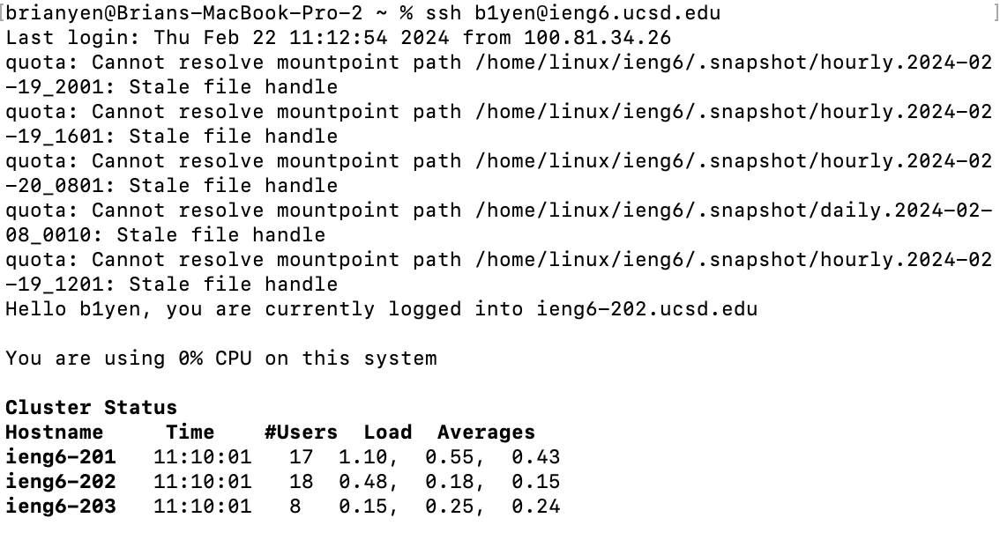
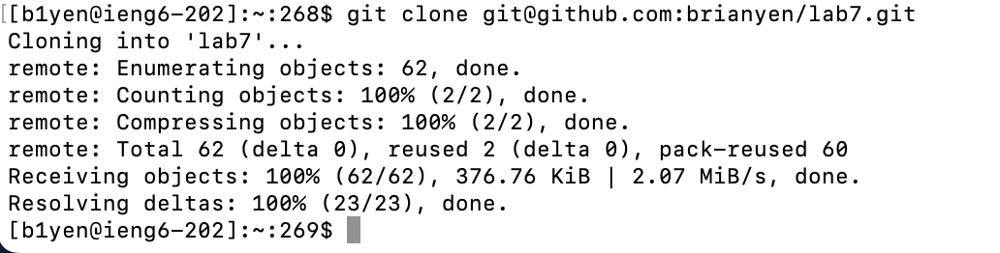
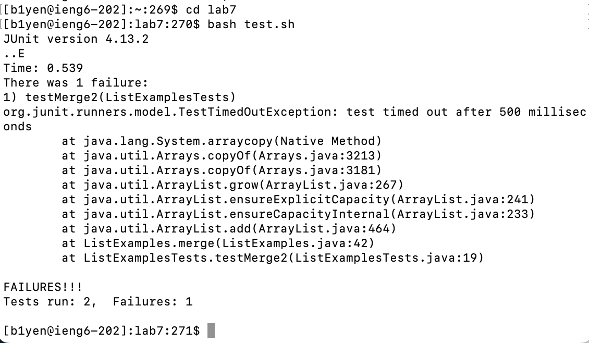
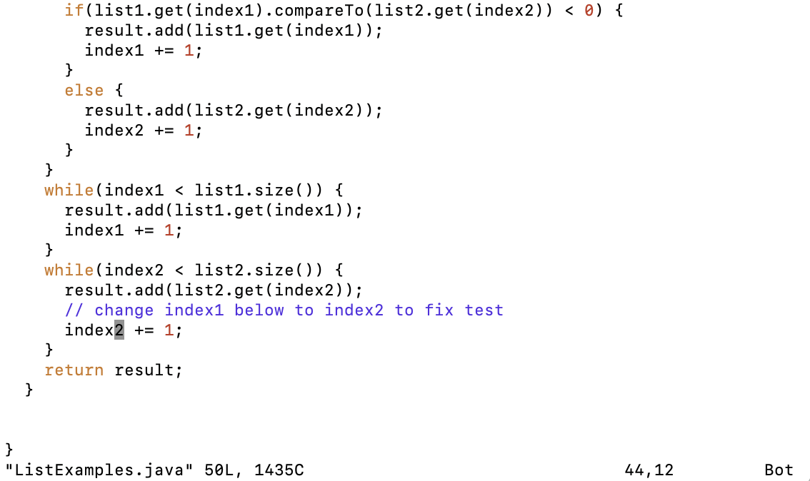
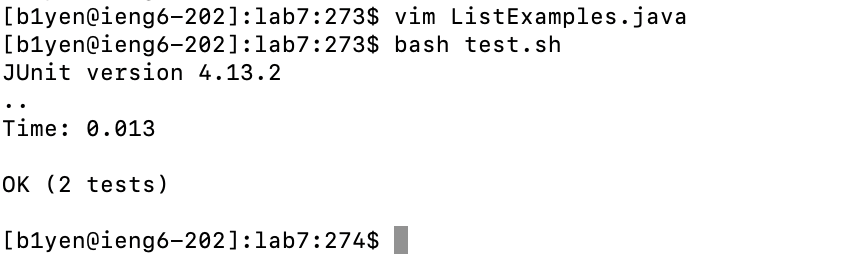
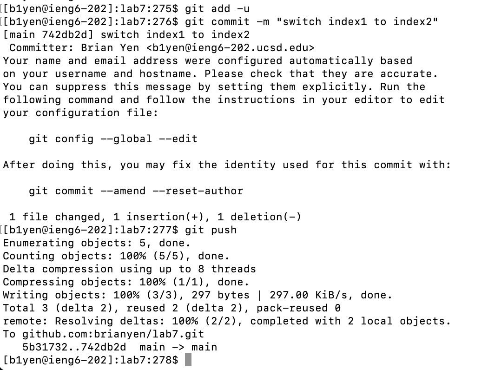

# Lab 4

## Step 4:

Keys: ```ssh b1yen@uieng6.ucsd.edu<enter>```



I manually typed the command to login to the remote machine. `<enter>` ran the command.

## Step 5:

Keys: ```git clone <cmd + v><enter>```



I manually typed `git clone` and then used `<cmd + v>` to paste the ssh url that I had on my clipboard from previously doing this. `<enter>` ran the command.

## Step 6:

Keys: ```cd lab7<enter>bash test.sh<enter>```



I manually typed the command `cd lab7` and hit `<enter>` to run it. I then ran the bash script manually by typing the command, and then hit `<enter>` to run it.

## Step 7:

Keys: ```vim ListExamples.j<tab><enter>43jer2:wq<enter>```




After manually typing `vim ListExamples.j`, I hit `<tab>` to auto-complete the last letter into the `.java` extension, then ran the command with `<enter>` to edit the file.

In the `vim` menu:
- `43j` moved my cursor down by 43 lines (I had already known where the era was beforehand).
- `e` moved to the end of the word, which was at the time `index1`
- `r2` replaced the character I was at, which was `1`, with `2`
- Running `:wq` with `<enter>` wrote my changes into the file and closed the `vim` interface.

## Step 8:

Keys: ```<up><up><enter>```



Pressing `<up>` twice went back in my command history by two, which was the `bash test.sh` command. `<enter>` ran the command.

## Step 9:

Keys: ```git add -u<enter>git commit -m "switch index1 to index2"<enter>git push<enter>```



Manually typing `git add -u` and running the command with `<enter>` staged all the changes to updated, existing files. 

Manually typing `git commit -m "switch index1 to index2"` and running that with `<enter>` updated the repository on my computer with my changes.

Manually typing `git push` and hitting `<enter>` to run it updated the repository hosted on GitHub.