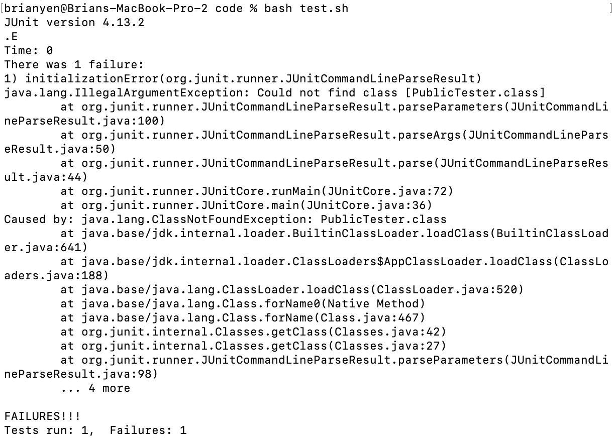
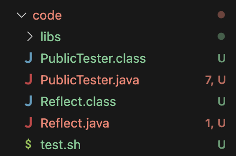
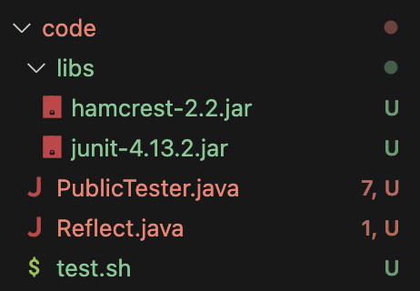
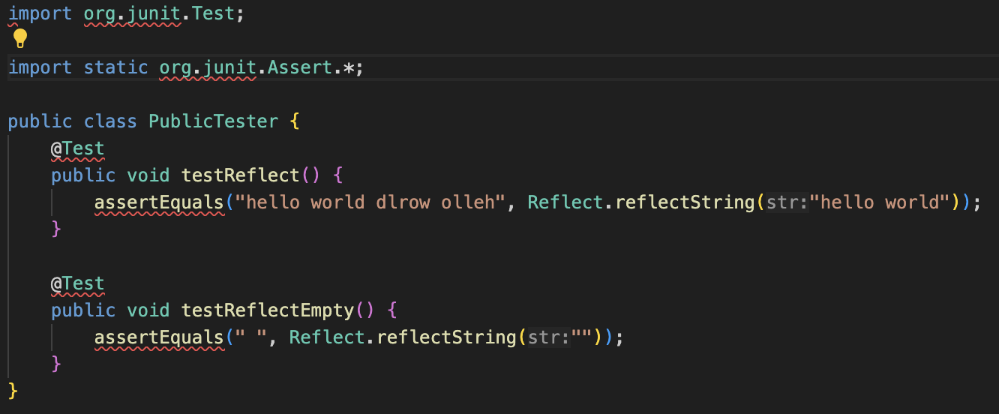
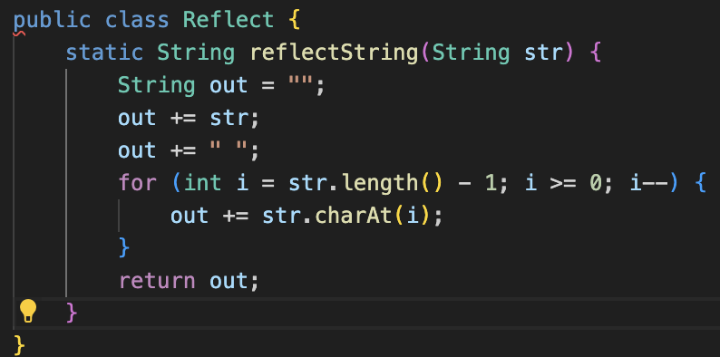
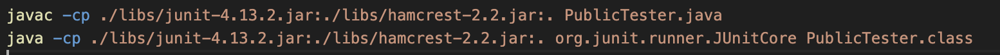
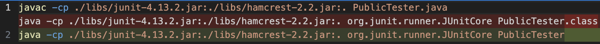
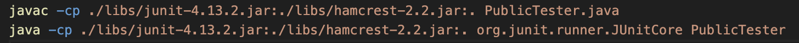

# lab 5

## part 1

 

<b>StemEd</b>

Unable to test reflect method

Brian Yen

posted yesterday

I've been trying to test my reflect method using JUnit and a bash script, but it is giving me the following symptoms: 
 
At first I thought there was a compilation error, but a class file seems to be properly created, so it seems like Reflect.java and PublicTester.java compile correctly. It says that there is no PublicTester.class, but I see it in my file system (attached below). Is there something wrong with my file names? 
File Tree: 

Replies

Yen Brian (TA)

posted yesterday

Hi! It would be helpful if you could also show a screenshot of your bash script or a cat of it. Based on your symptom, I would suggest double checking the name of the file that you're running with the java command in your bash script, particularly looking at the file extension.

 

Brian Yen

posted yesterday

I took a look at my bash script:

    cat test.sh 
    javac -cp ./libs/junit-4.13.2.jar:./libs/hamcrest-2.2.jar:. PublicTester.java 
    java -cp ./libs/junit-4.13.2.jar:./libs/hamcrest-2.2.jar:. org.junit.runner.JUnitCore PublicTester.class

I checked the extension again, and it looks like I forgot to omit the .class part when running my code. Thanks for the help!

## Setup for part 1

### File Tree:

### File Contents:
PublicTester.java (already correct):

Reflect.java (already correct):

test.sh (bugged):

### Commands to Recreate the Bug:

To recreate the bug, just run `bash test.sh`

### Fixing the Bug:

The bug is that the second line in `test.sh` tries to run `PublicTester.class`, when the class file should have the extension ommitted. The only change needed to be made is to remove the `.class`.

### Content of test.sh After the Bug Fix:

## part 2

One thing that I didn't know about beforehand was about `vim`. I knew it existed, in fact, I was one of the people who saw someone on Stack Overflow say to use `vim` to do something, try it, and get stuck in there. Because of that experience, I thought it was really interesting to learn about how it actually all works. Even though it feels less wieldy than a normal text editor, it was still cool to learn how to do various tricks there like the find and replace, copy and paste, and more. 

Another thing that I really appreciate learning about was the shortcuts on the terminal that let you go to the beginning of a line, end of a line, back one word, and so on. I hadn't known those before, and it's a lot nicer to be able to use these when I have to fix something in a long command.

One other thing that I thought was pretty interesting to learn about was standard in, standard out, and standard error. Those were terms I had heard thrown around before, and hearing about them a little more during lecture was pretty cool. It also prompted me to read a little bit more about them.